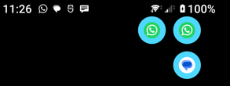

# Blinken

A software replacement for a hardware notification LED, for Android phones that don't have one (originally built for a Sony Xperia 5 V).

Blinken listens for notifications from a user-configurable allowlist of apps and shows something over the lock screen instead of turning on the whole display. Unplugged, it briefly shows a small icon — patterned after the notifying app — re-appearing every minute or so for as long as the notification stays unread, similar to a real notification LED's persistent blink, then stops the instant it's read or dismissed. While charging, every currently-unread notification instead renders continuously as a small icon that joins a moving "snake" sweeping the screen, so a glance shows everything unread at once without a static image risking OLED burn-in — a lighter-weight, less battery/OLED-wearing alternative to leaving the always-on clock display enabled either way.



The name is short for "Blinkenlights," a nod to the German-English computer-room folklore sign warning not to touch the blinking lights on old mainframes.

## How it works

1. Grant Blinken notification access (Settings → Apps → Special access → Notification access) — there's no runtime permission dialog for this. On Android 13+/14+ it also needs the notification and full-screen-notification permissions; Blinken's settings screen prompts for whichever of these are missing.
2. Add apps to the allowlist in Blinken's settings screen, and pick a color and flash duration for each.
3. When an allowlisted app posts a notification, Blinken shows something over the lock screen without unlocking the device or lighting up the whole display:
   - **Unplugged:** a brief colored badge with that app's icon, auto-dismissing after a few seconds. If the notification is still unread a minute later, it shows again — repeating until you read or dismiss it.
   - **Charging:** every currently-unread allowlisted notification renders as a small badge, and all of them move together as a snake, continuously sweeping the whole screen until everything is read or dismissed.

An "eco mode" toggle limits how often repeat notifications from the same app can re-trigger the *first* flash (the repeat-until-dismissed reminders are a separate, slower cadence and aren't affected by eco mode).

## Status

v1.1: notification listening, per-app allowlist with color/duration, the lockscreen flash, repeat-until-dismissed reminders, and the continuous charging-mode snake display are implemented. Not yet built: a foreground service to improve reliability against aggressive OEM background-process killing (e.g. Sony's Stamina mode) — for now, the app requests a battery-optimization exemption instead, and reminders use `AlarmManager` rather than a foreground service. See `CLAUDE.md` for architecture notes and `app-suggestions.txt` for the original design discussion.

## Building

```
./gradlew assembleDebug
```

Requires JDK 11+ and the Android SDK (targetSdk 36, minSdk 24). See `CLAUDE.md` for test commands and architecture details.
